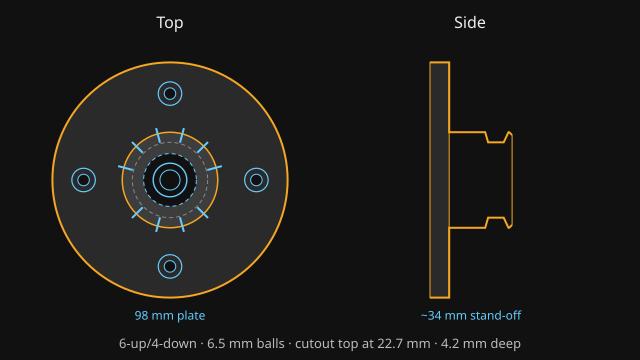
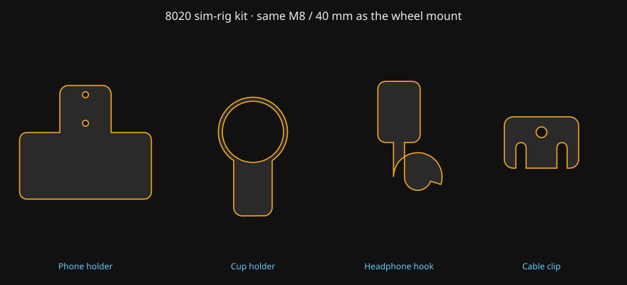

# D1 QR steering-wheel wall mount

3D-printable hanger for **MOZA** wheels (ES, RS, CS, GS, FSR — anything with the stock ball-lock QR) and other **D1-spec / Simagic-style** 50 mm ball QRs.

Snap the wheel onto the stub the same way you clip it onto the base. **Six ball pockets** lock rotation so the wheel should not spin when bumped. Line up the balls with the seats, then press on (six possible orientations — one of them is upright).

A ring-groove version with no pockets is also in `stl/` if you ever want free rotation.

This is an original product design, not a MOZA part and not a copy of a commercial listing.

**Want to sell prints?** Read [`SELLING.md`](SELLING.md) (Etsy title, compatible-with wording, PETG QC, photos).



## Print these files

| File | What it is |
| --- | --- |
| [`stl/fit_test_nominal.stl`](stl/fit_test_nominal.stl) | **Print this first.** Tiny coupon, ~15 minutes. |
| [`stl/moza_qr_universal_mount.stl`](stl/moza_qr_universal_mount.stl) | **The one print.** Round plate. **M8 through the middle of the stub** (one T-nut or a stud) + 4× #8 around the rim. 6 anti-spin pockets. |
| [`stl/fit_test_tight.stl`](stl/fit_test_tight.stl) / [`stl/fit_test_loose.stl`](stl/fit_test_loose.stl) | Same coupon, ±0.4 mm on the shaft if nominal is off. |
| [`stl/moza_qr_wall_mount_free.stl`](stl/moza_qr_wall_mount_free.stl) | Same universal plate, ring groove, wheel can rotate. |

`moza_qr_wall_mount.stl` and `moza_qr_8020_mount.stl` are copies of the universal file so old links still work.

### 8020 sim-rig kit (same M8 hardware)



All four use **M8 × 16–20 mm** bolts and T-nuts. The wheel mount uses **one M8 through the centre of the stub** (a longer bolt — see Hardware). Print in PETG, no supports.

| File | What it is | On the bed |
| --- | --- | --- |
| [`stl/8020_phone_holder.stl`](stl/8020_phone_holder.stl) | Landscape tray for a phone + case up to **174 × 88 × 16 mm**. Open top (cable out the top). 4× M8 in a plus — vertical pair on an upright, horizontal pair on a dash bar. | Flat back down, walls up |
| [`stl/8020_cup_holder.stl`](stl/8020_cup_holder.stl) | 86 mm ID cup / tumbler, 52 mm deep, drain hole. **Bolt to the top of a 4040 / 2020 beam** so the cup sits upright. | Floor down, opening up |
| [`stl/8020_headphone_hook.stl`](stl/8020_headphone_hook.stl) | J-hook for a headset. 2× M8, 20 mm thick. Side upright, hook into the room. | Flat |
| [`stl/8020_cable_clip.stl`](stl/8020_cable_clip.stl) | One M8, two snap slots for USB / power leads. | Flat |

Phone too tight / too loose: edit `PHONE_INNER_W` / `PHONE_INNER_H` / `PHONE_DEPTH` in `accessories.py`. Cup too snug: raise `CUP_ID`.

Regenerate STLs after editing dimensions:

```bash
python3 generate.py            # wheel mount + accessories, nominal QR fit
python3 generate.py --fit loose
python3 accessories.py         # accessories only
```

Or open `moza_qr_wall_mount.scad` in OpenSCAD and export the wheel mount.

## Bambu Lab print settings

Print **plate on the bed, stub pointing up**. No supports. The groove walls are 45° so a P1S / X1C / A1 will handle them.

| Setting | Value |
| --- | --- |
| Material | **PETG** (best). PLA or PLA-CF is fine for a light ES/RS wheel if the room stays cool. |
| Nozzle | 0.4 mm |
| Layer height | 0.20 mm (0.16 mm if you want a cleaner groove) |
| Walls | **6** (or 2.4 mm wall thickness) |
| Top / bottom | 5 |
| Infill | 40% gyroid |
| Supports | None |
| Brim | 5 mm, or a textured PEI plate with glue stick |
| Outer wall speed | ~40–60 mm/s so the shaft stays round |

A CS/GS wheel is ~1–1.5 kg hanging on a plastic stub. PETG + 6 walls is the conservative choice. After the first print, snap the wheel on **without** hanging it on the wall and tug it — it should click and not slide off under its own weight.

The 8020 accessories are lighter. **4 walls / 25% gyroid** is enough for the phone tray, cup, and cable clip. Use **6 walls / 40%** on the headphone hook (it is a cantilever).

## Fit check

1. Print `fit_test_nominal.stl`.
2. Pull the gold/black QR collar and push the wheel on. It should snap. Pull the collar to release.
3. If it will not go on → print `fit_test_loose.stl` (or in `generate.py` drop `shaft_d` / `groove_d` by 0.4).
4. If it goes on but will not lock → print `fit_test_tight.stl`, or make sure you are pushing until the balls drop into the groove.
5. When the coupon feels right, print the matching full mount (`generate.py --fit …` if you changed it).

Nominal numbers (plastic, a little under the ~50 mm metal male QR):

- Shaft Ø **49.4 mm**
- Groove Ø **45.4 mm**, 45° walls, ~8.8 mm from the tip

## Hardware

One print. Pick how you hang it:

**On a wall**

- 1× **M8 × 45–50 mm** socket-cap through the hole in the **middle of the stub**, into a **stud**.
- 4× **#8 × 1¼″** wood screws around the rim (anchors if they miss a stud).

**On a sim rig (4040 / 2020)**

- 1× **M8 × 45–50 mm** socket-cap + T-nut, dropped in from the stub opening (the head sits in a counterbore at the tip). Hidden once the wheel is on.
- Leave the four #8 holes empty, or snug the M8 so the plate cannot rotate on the bolt.

The phone / cup / hook / clip take shorter **M8 × 16–20 mm** T-nut bolts. Phone holder: two of the four plus-pattern holes. Cup holder: two holes through the tab, into the **top** slot of a beam.

Do not hang this on a single drywall anchor.

## Use

1. Wall: one M8 through the stub into a stud, plus four #8 around the rim. Rig: one M8 × 45–50 mm through the stub into a T-nut. Stub points into the room.
2. Line up the six balls on the wheel with the six seats on the stub (same idea as the base). Press on until it clicks.
3. To remove: pull the QR collar with both hands and take the wheel off, same as on the base.

If the wheel sits a little rotated, try the next click (there are six). To shift the seats, change `POCKET_OFFSET_DEG` in `generate.py` and regenerate.

Paddle clearance: the plate is 98 mm across. If paddles kiss the plate, increase `SHAFT_LEN` in `generate.py`.

## Tuning (`generate.py`)

| Constant | Default | What it does |
| --- | --- | --- |
| `FITS["nominal"].shaft_d` | 49.4 | Outer Ø the QR slides over |
| `FITS["nominal"].groove_d` | 45.4 | Groove floor Ø (balls lock here) |
| `SHAFT_LEN` | 26 | How far the stub sticks out |
| `PLATE_D` / `PLATE_T` | 98 / 8 | Wall plate size |
| `CENTER_HOLE_D` | 8.4 | M8 through the middle of the stub |
| `POCKET_OFFSET_DEG` | 90 | Rotate the six seats (90 = one at 12 o'clock) |

Accessories (`accessories.py`): `PHONE_INNER_W` / `PHONE_INNER_H` / `PHONE_DEPTH`, `CUP_ID`, `HOOK_INNER`.

## License

All rights reserved — see `LICENSE`. You may sell physical prints and digital files of this design. Do not publish the STLs on a public site if you are charging for them. Not affiliated with MOZA Racing.
